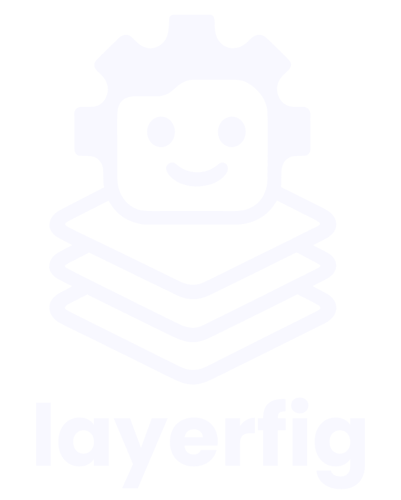

 
   
  A simple way to implement configuration layering. It allows you to define multiple configuration sources, which are then merged into a single, type-safe configuration object.

  
  
  
  

### [Read the docs →](https://layerfig.raulmelo.workers.dev)
